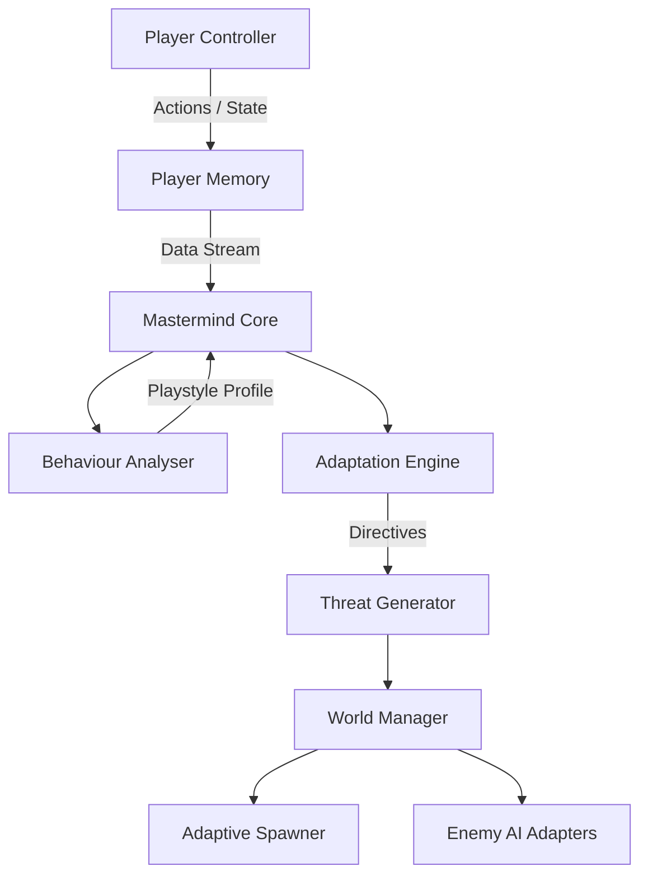

# Vespera 🌌

> A fully offline, high-end single-player experience with a living AI Mastermind that learns, adapts, and evolves against you.


**Vespera** is an ambitious, fully local single-player game. No cloud processing, no mandatory online connection—just a deep, evolving world packaged into a clean, highly optimized executable. 

At its core sits the **AI Mastermind**: an advanced, localized Director AI that observes your playstyle in real-time, learns from your actions, and dynamically alters the environment, enemy behavior, and threat levels to counter your exact strategies.

---

## 🧠 The AI Mastermind Architecture

Vespera relies on a highly modular and localized data-driven AI architecture to achieve deep systemic gameplay.

### Core Data Flow
1. **Observation (`player_controller.gd` & `player_memory.gd`)**
   Every significant action (movement patterns, combat choices, stealth mechanics, resource usage) is recorded locally and transmitted as a lightweight data stream to the Mastermind.
   
2. **Analysis (`behaviour_analyser.gd`)**
   The Analyser processes the live data stream to classify the player's current playstyle (e.g., *Aggressive*, *Stealthy*, *Hoarder*).

3. **Adaptation (`adaptation_engine.gd`)**
   Using the classified playstyle, the Adaptation Engine formulates dynamic rules. For example, if a player relies heavily on stealth, the Engine will temporarily boost enemy perception stats and modify their patrol routes.

4. **Execution (`threat_generator.gd` & `adaptive_spawner.gd`)**
   Directives are issued to the World Manager and the Adaptive Spawner. The game dynamically alters fog density, spawns specialized enemy counters, or upgrades the stats of currently existing enemies via `enemy_adaptation.gd`.

### System Diagram



---

## 📂 Project Structure

```text
Vespera/
├── assets/          # High-quality PBR textures, 3D models, and Audio
├── data/            # Local JSON state (player_behaviour.json, rules)
├── scenes/          # Godot .tscn files grouped by feature
│   ├── enemies/     # Adaptive enemy base scenes
│   ├── mastermind/  # Core AI controllers
│   ├── player/      # Player character and camera rig
│   └── world/       # Dynamic environments
├── scripts/         # Production GDScript implementations
└── shaders/         # High-end Post-Processing & Adaptive Fog GDShaders
```

## 🛠️ Tech Stack & Requirements

- **Engine**: [Godot 4.3 (Forward+ Renderer)](https://godotengine.org/)
- **Language**: GDScript
- **Rendering**: High-quality Shadows, SSAO, SSR, Volumetric Fog
- **Data**: Lightweight local JSON parsing (No SQL/Databases required)

## 🚀 Getting Started

1. Clone the repository:
   ```bash
   git clone https://github.com/NivedhN160/Vespera.git
   ```
2. Open the project folder in **Godot 4.3**.
3. Open `scenes/main.tscn` and press **F5** to run the project locally.

## 🤝 Contributing
Since Vespera is built heavily around an interconnected AI system, any pull requests modifying enemy behavior or player mechanics should ensure that `player_controller.gd` continues to emit accurate signals to `mastermind_core.gd`.

---
*Vespera is designed to feel like it is actively fighting you. Good luck.*
